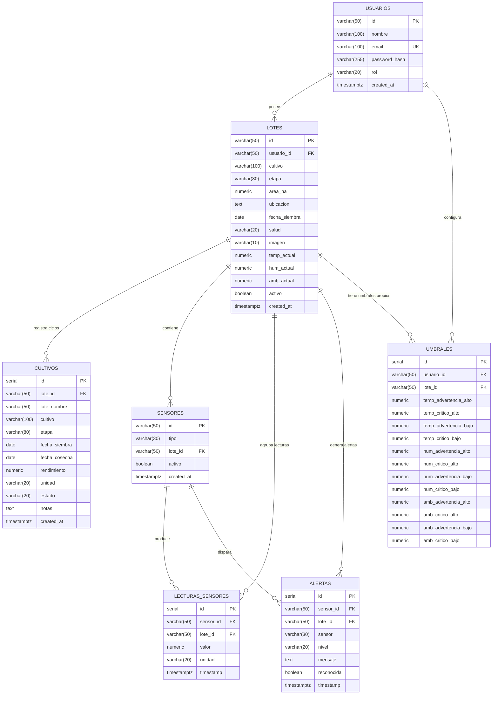

# Conuco Tech — Diagrama Entidad-Relación

## Opción 1: Mermaid (GitHub, Notion, VS Code)

Pega esto en [mermaid.live](https://mermaid.live) y exporta como PNG/SVG.



---

## Opción 2: DBML — para [dbdiagram.io](https://dbdiagram.io)

Pega esto en dbdiagram.io → *Import* → exporta en PNG/PDF/SVG.

```
// Conuco Tech — Database Schema
// Mejoras v2: alertas conectada via FK, umbrales por lote, lecturas con lote_id

Table usuarios {
  id            varchar(50)  [pk, note: 'usr-{timestamp}']
  nombre        varchar(100) [not null]
  email         varchar(100) [unique, not null]
  password_hash varchar(255) [not null]
  rol           varchar(20)  [not null, default: 'USUARIO']
  created_at    timestamptz  [default: `now()`]
}

Table lotes {
  id            varchar(50)  [pk]
  usuario_id    varchar(50)  [ref: > usuarios.id]
  cultivo       varchar(100) [not null]
  etapa         varchar(80)
  area_ha       decimal(10,2)
  ubicacion     text
  fecha_siembra date
  salud         varchar(20)  [default: 'optima', note: 'optima | advertencia | critica']
  imagen        varchar(10)
  temp_actual   decimal(6,2) [note: 'última lectura °C']
  hum_actual    decimal(6,2) [note: 'última lectura %']
  amb_actual    decimal(8,2) [note: 'última lectura humedad ambiental (%) o luz solar (lux)']
  activo        boolean      [default: true]
  created_at    timestamptz  [default: `now()`]
}

Table cultivos {
  id            int          [pk, increment]
  lote_id       varchar(50)  [ref: > lotes.id]
  lote_nombre   varchar(50)
  cultivo       varchar(100) [not null]
  etapa         varchar(80)
  fecha_siembra date
  fecha_cosecha date
  rendimiento   decimal(8,2)
  unidad        varchar(20)  [default: 'ton/ha']
  estado        varchar(20)  [default: 'en_curso', note: 'completado | en_curso | abandonado']
  notas         text
  created_at    timestamptz  [default: `now()`]
}

Table sensores {
  id         varchar(50) [pk, note: 'MAC address del ESP32']
  tipo       varchar(30) [not null, note: 'TEMPERATURA | HUMEDAD_SUELO | HUMEDAD_AMBIENTAL | LUZ_SOLAR']
  lote_id    varchar(50) [ref: > lotes.id]
  activo     boolean     [default: true]
  created_at timestamptz [default: `now()`]
}

Table lecturas_sensores {
  id        int          [pk, increment]
  sensor_id varchar(50)  [ref: > sensores.id]
  lote_id   varchar(50)  [ref: > lotes.id, note: 'desnormalizado — evita JOIN para queries por lote']
  valor     decimal(10,4) [not null]
  unidad    varchar(20)
  timestamp timestamptz  [default: `now()`]

  indexes {
    (sensor_id, timestamp) [name: 'idx_lecturas_sensor_ts']
    (lote_id, timestamp)   [name: 'idx_lecturas_lote_ts']
  }
}

Table alertas {
  id         int         [pk, increment]
  sensor_id  varchar(50) [ref: > sensores.id, note: 'qué sensor físico disparó la alerta']
  lote_id    varchar(50) [ref: > lotes.id,    note: 'qué parcela fue afectada']
  sensor     varchar(30) [not null, note: 'tipo: temperatura | humedad | ambiental']
  nivel      varchar(20) [not null, note: 'critica | advertencia']
  mensaje    text        [not null]
  reconocida boolean     [default: false]
  timestamp  timestamptz [default: `now()`]

  indexes {
    timestamp [name: 'idx_alertas_timestamp']
    lote_id   [name: 'idx_alertas_lote']
  }
}

Table umbrales {
  id                    int         [pk, increment]
  usuario_id            varchar(50) [ref: > usuarios.id]
  lote_id               varchar(50) [ref: > lotes.id, note: 'NULL = umbral global del usuario']
  temp_advertencia_alto decimal(5,2) [default: 28]
  temp_critico_alto     decimal(5,2) [default: 32]
  temp_advertencia_bajo decimal(5,2) [default: 18]
  temp_critico_bajo     decimal(5,2) [default: 14]
  hum_advertencia_alto  decimal(5,2) [default: 75]
  hum_critico_alto      decimal(5,2) [default: 85]
  hum_advertencia_bajo  decimal(5,2) [default: 45]
  hum_critico_bajo      decimal(5,2) [default: 30]
  amb_advertencia_alto  decimal(8,2) [default: 70]
  amb_critico_alto      decimal(8,2) [default: 80]
  amb_advertencia_bajo  decimal(8,2) [default: 40]
  amb_critico_bajo      decimal(8,2) [default: 30]

  indexes {
    (usuario_id, lote_id) [unique, name: 'uq_umbrales_usuario_lote']
  }
}
```

---

## Relaciones — resumen v2

| Origen               | Cardinalidad | Destino              | Descripción                                    |
|----------------------|:------------:|----------------------|------------------------------------------------|
| `usuarios`           | 1 → N        | `lotes`              | Un productor posee varias parcelas             |
| `usuarios`           | 1 → N        | `umbrales`           | Un usuario tiene umbrales (global + por lote)  |
| `lotes`              | 1 → N        | `cultivos`           | Una parcela registra múltiples ciclos          |
| `lotes`              | 1 → N        | `sensores`           | Una parcela contiene varios sensores ESP32     |
| `lotes`              | 1 → N        | `lecturas_sensores`  | Acceso directo a lecturas sin JOIN extra        |
| `lotes`              | 1 → N        | `alertas`            | Saber qué parcela generó cada alerta           |
| `lotes`              | 1 → N        | `umbrales`           | Umbrales específicos por parcela (nullable)    |
| `sensores`           | 1 → N        | `lecturas_sensores`  | Un sensor genera muchas lecturas               |
| `sensores`           | 1 → N        | `alertas`            | Saber qué sensor físico disparó la alerta      |
